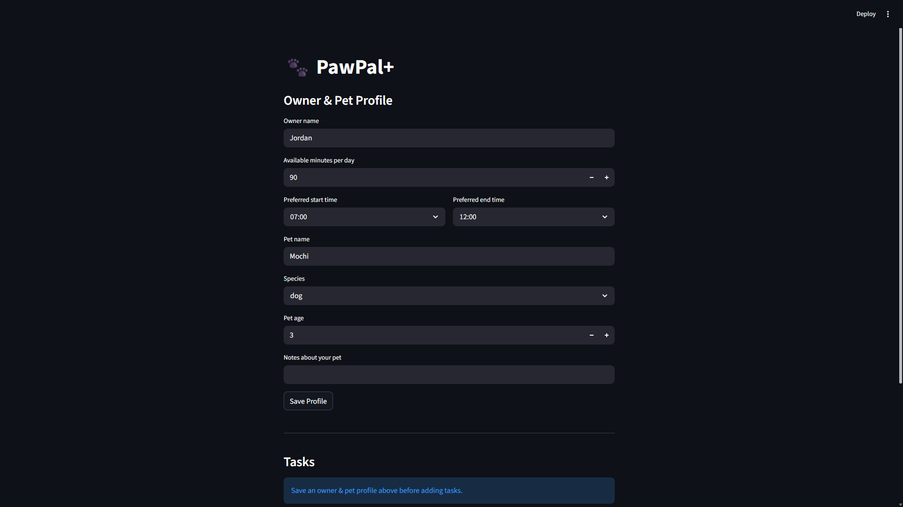
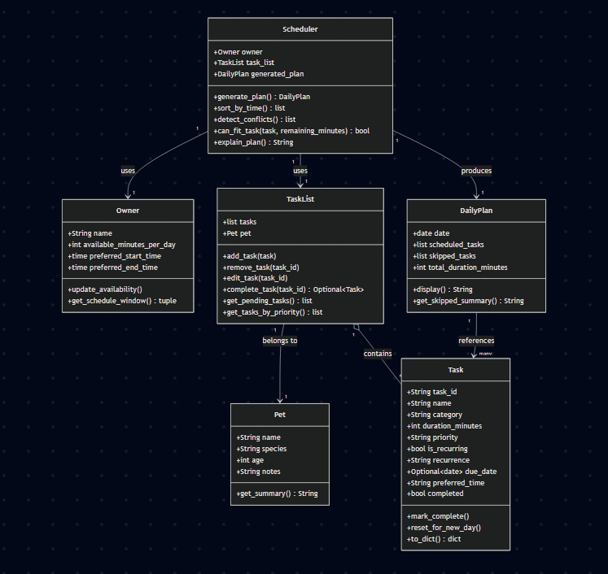

# PawPal+

A Streamlit-powered pet care scheduling app that helps busy owners plan daily tasks for their pets using priority-based scheduling, conflict detection, and recurring task automation.

## Table of Contents

- [Features](#features)
- [Demo](#-demo)
- [Getting Started](#getting-started)
- [Project Structure](#project-structure)
- [How It Works](#how-it-works)
- [Testing](#testing)
- [Design](#design)

## Features

- **Priority-based scheduling** — The scheduler uses a greedy algorithm that sorts pending tasks by priority (high > medium > low) and fills the owner's available time window from most to least critical. High-priority tasks like medication are never skipped in favor of multiple lower-priority ones.
- **Chronological sorting** — `Scheduler.sort_by_time()` reorders scheduled tasks by start time using a lambda key on zero-padded "HH:MM" strings, where lexicographic order equals chronological order. Runs in O(n log n) time.
- **Conflict detection** — `Scheduler.detect_conflicts()` performs a pairwise comparison of all scheduled tasks using the interval overlap test (`start_a < end_b AND start_b < end_a`) to flag any time collisions. Runs in O(n^2) time, which is acceptable for typical daily schedules of fewer than 15 tasks.
- **Cross-pet conflict detection** — `detect_cross_pet_conflicts()` extends the same overlap logic across multiple pets' schedules, catching cases where one owner is double-booked between pets.
- **Daily and weekly recurrence** — When a recurring task is marked complete, `TaskList.complete_task()` automatically creates the next occurrence using `timedelta` arithmetic (today + 1 day for daily, today + 7 days for weekly) and appends it to the task list.
- **Task filtering** — `filter_tasks()` searches across multiple `TaskList` objects by completion status, pet name, or both using AND logic with case-insensitive pet name matching.
- **Skipped task explanations** — Tasks that cannot fit within the time budget or schedule window are collected with a human-readable reason, so the owner understands exactly why a task was left out.
- **Professional UI** — The Streamlit interface uses `st.success` for confirmations, `st.warning` for conflicts and skipped tasks, `st.table` for structured data display, and `st.text` for the plain-language scheduler explanation.

## Demo



## Getting Started

### Prerequisites

- Python 3.10+

### Setup

```bash
python -m venv .venv
source .venv/bin/activate  # Windows: .venv\Scripts\activate
pip install -r requirements.txt
```

### Run the App

```bash
streamlit run app.py
```

### Run the Demo Script

```bash
python main.py
```

This executes a full walkthrough of scheduling, sorting, conflict detection, recurrence, and filtering with sample data.

## Project Structure

```
pawpal-starter/
├── app.py                  # Streamlit UI
├── pawpal_system.py        # All backend classes and helper functions
├── main.py                 # CLI demo / integration test script
├── tests/
│   └── test_pawpal.py      # 13 unit tests across 5 categories
├── requirements.txt        # streamlit, pytest
├── reflection.md           # Design decisions and tradeoff analysis
├── uml_final.png           # Final UML class diagram
└── pawpal_mermaid.mermaid  # UML source in Mermaid syntax
```

### Key Classes

| Class       | Responsibility                                                                                                      |
| ----------- | ------------------------------------------------------------------------------------------------------------------- |
| `Pet`       | Stores pet identity (name, species, age, notes)                                                                     |
| `Task`      | Represents a single care task with priority, duration, recurrence, and completion state                             |
| `Owner`     | Holds the owner's daily time budget and preferred schedule window                                                   |
| `TaskList`  | Manages a collection of tasks for one pet; handles add/remove/edit/complete operations                              |
| `DailyPlan` | Holds the output of scheduling: which tasks were scheduled (with start times) and which were skipped (with reasons) |
| `Scheduler` | Core algorithm engine: generates plans, sorts by time, detects conflicts, and explains decisions                    |

### Helper Functions

| Function                                        | Purpose                                                             |
| ----------------------------------------------- | ------------------------------------------------------------------- |
| `_add_minutes(t, minutes)`                      | Safely adds minutes to a `time` object using `timedelta` arithmetic |
| `detect_cross_pet_conflicts(schedulers)`        | Finds time overlaps across different pets' schedules                |
| `filter_tasks(task_lists, completed, pet_name)` | Queries tasks across multiple pets by status and name               |

## How It Works

1. **Profile setup** — The owner enters their name, available minutes per day, and preferred start/end times. They also register their pet's details.
2. **Task entry** — Tasks are added with a title, duration, priority (high/medium/low), and category (walk, feeding, medication, grooming, enrichment, other).
3. **Schedule generation** — Clicking "Generate schedule" triggers the scheduler, which:
   - Collects all pending (incomplete) tasks
   - Sorts them by priority (high first)
   - Greedily assigns each task a start time within the owner's time window
   - Skips tasks that exceed the remaining time budget or the window end time
4. **Display** — The generated plan is sorted chronologically and displayed in a table. Conflict warnings appear as alerts. Skipped tasks show the specific reason they were excluded. A plain-language explanation summarizes the scheduling decisions.

## Testing

```bash
python -m pytest tests/test_pawpal.py -v
```

### Test Coverage

| Category            | Tests | What Is Verified                                                                                                                             |
| ------------------- | ----- | -------------------------------------------------------------------------------------------------------------------------------------------- |
| Task Completion     | 1     | `mark_complete()` flips the completed flag                                                                                                   |
| Task Addition       | 1     | `add_task()` correctly grows the task list                                                                                                   |
| Sorting Correctness | 3     | `sort_by_time()` returns chronological order, handles empty plans, and works with a single task                                              |
| Recurrence Logic    | 4     | Daily completion creates a task due tomorrow; weekly creates one due in 7 days; non-recurring returns `None`; nonexistent IDs handled safely |
| Conflict Detection  | 4     | Identical start times flagged; sequential tasks produce no warnings; cross-pet overlaps detected; staggered cross-pet tasks pass cleanly     |

**Confidence: 4/5** — All core scheduling paths are tested. UI integration and stress scenarios (large task lists) are not yet covered.

## Design


